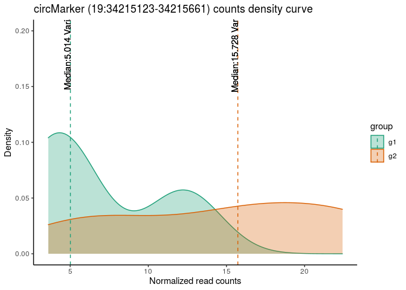

<!-- README.md is generated from README.Rmd. Please edit that file -->

# CircTarget

<!-- badges: start -->

<!-- badges: end -->

The goal of CircTarget is to detect the molecular pathways associated
with the expression levels of the target circRNAs.

## Installation

You can install the development version from
[GitHub](https://github.com/ABuratin/CircTarget) with:

``` r
# install.packages("devtools")
devtools::install_github("ABuratin/CircTarget")
```

## Example

This is a basic example which shows you how to detect circRNA-target:

``` r

library(CircTarget)
library(DESeq2)
#> Loading required package: S4Vectors
#> Loading required package: stats4
#> Loading required package: BiocGenerics
#> Loading required package: parallel
#> 
#> Attaching package: 'BiocGenerics'
#> The following objects are masked from 'package:parallel':
#> 
#>     clusterApply, clusterApplyLB, clusterCall, clusterEvalQ,
#>     clusterExport, clusterMap, parApply, parCapply, parLapply,
#>     parLapplyLB, parRapply, parSapply, parSapplyLB
#> The following objects are masked from 'package:stats':
#> 
#>     IQR, mad, sd, var, xtabs
#> The following objects are masked from 'package:base':
#> 
#>     anyDuplicated, append, as.data.frame, basename, cbind, colnames,
#>     dirname, do.call, duplicated, eval, evalq, Filter, Find, get, grep,
#>     grepl, intersect, is.unsorted, lapply, Map, mapply, match, mget,
#>     order, paste, pmax, pmax.int, pmin, pmin.int, Position, rank,
#>     rbind, Reduce, rownames, sapply, setdiff, sort, table, tapply,
#>     union, unique, unsplit, which, which.max, which.min
#> 
#> Attaching package: 'S4Vectors'
#> The following object is masked from 'package:base':
#> 
#>     expand.grid
#> Loading required package: IRanges
#> Loading required package: GenomicRanges
#> Loading required package: GenomeInfoDb
#> Loading required package: SummarizedExperiment
#> Loading required package: Biobase
#> Welcome to Bioconductor
#> 
#>     Vignettes contain introductory material; view with
#>     'browseVignettes()'. To cite Bioconductor, see
#>     'citation("Biobase")', and for packages 'citation("pkgname")'.
#> Loading required package: DelayedArray
#> Loading required package: matrixStats
#> 
#> Attaching package: 'matrixStats'
#> The following objects are masked from 'package:Biobase':
#> 
#>     anyMissing, rowMedians
#> Loading required package: BiocParallel
#> 
#> Attaching package: 'DelayedArray'
#> The following objects are masked from 'package:matrixStats':
#> 
#>     colMaxs, colMins, colRanges, rowMaxs, rowMins, rowRanges
#> The following objects are masked from 'package:base':
#> 
#>     aperm, apply, rowsum
library(ggplot2)
library(dplyr)
#> 
#> Attaching package: 'dplyr'
#> The following object is masked from 'package:matrixStats':
#> 
#>     count
#> The following object is masked from 'package:Biobase':
#> 
#>     combine
#> The following objects are masked from 'package:GenomicRanges':
#> 
#>     intersect, setdiff, union
#> The following object is masked from 'package:GenomeInfoDb':
#> 
#>     intersect
#> The following objects are masked from 'package:IRanges':
#> 
#>     collapse, desc, intersect, setdiff, slice, union
#> The following objects are masked from 'package:S4Vectors':
#> 
#>     first, intersect, rename, setdiff, setequal, union
#> The following objects are masked from 'package:BiocGenerics':
#> 
#>     combine, intersect, setdiff, union
#> The following objects are masked from 'package:stats':
#> 
#>     filter, lag
#> The following objects are masked from 'package:base':
#> 
#>     intersect, setdiff, setequal, union
library(plyr)
#> ------------------------------------------------------------------------------
#> You have loaded plyr after dplyr - this is likely to cause problems.
#> If you need functions from both plyr and dplyr, please load plyr first, then dplyr:
#> library(plyr); library(dplyr)
#> ------------------------------------------------------------------------------
#> 
#> Attaching package: 'plyr'
#> The following objects are masked from 'package:dplyr':
#> 
#>     arrange, count, desc, failwith, id, mutate, rename, summarise,
#>     summarize
#> The following object is masked from 'package:matrixStats':
#> 
#>     count
#> The following object is masked from 'package:IRanges':
#> 
#>     desc
#> The following object is masked from 'package:S4Vectors':
#> 
#>     rename

## load data for example
data("circularData")
data("meta")
data("coldata.df")
data("dds.circular")
## Filter out low circRNA
data.filt <- circularData[rowSums(circularData >= 5) >= 3,]
dds.filt.expr <- suppressMessages(DESeqDataSetFromMatrix(countData = ceiling(data.filt[,coldata.df$sample_id[order(coldata.df$condition)]]),
                                   colData = coldata.df[order(coldata.df$condition),],
                                   design = ~ condition))
dds.filt.expr <- suppressMessages(estimateSizeFactors(dds.filt.expr))
sf.filt <- sizeFactors(dds.filt.expr)
circNormDeseq <- counts(dds.filt.expr, normalized = T)
```

Use `marker.selection` function to find out circRNA-target specifing: \*
adjusted p-value cutoff \* log fold change cutoff \* method for
calculate distance acrosso items \* method for
clustering

``` r
circtarget <- marker.selection(dat = data.filt, dds = dds.filt.expr, sf = sf.filt, p.cutoff = 0.1, lfc.cutoff = 1.5, 
                                 method.d = "euclidean", method.c = "ward.D2", k = 2)
#> Loading required package: foreach
#> Loading required package: iterators
#> 
#> Attaching package: 'tidyr'
#> The following object is masked from 'package:S4Vectors':
#> 
#>     expand
#> Warning: attributes are not identical across measure variables;
#> they will be dropped
```

For instance, you can see the distribution of circRNA-target:

``` r

circMark <- circtarget$circ.targetIDS[1]
circMark_group.df <- circtarget$group.df[circtarget$group.df$circ_id==circMark,]
circMark_group.df$counts <- merge(circMark_group.df, reshape2::melt(circNormDeseq[circMark,]), by.x = "sample_id", by.y = "row.names")[,"value"]
mu <- ddply(circMark_group.df, "group", summarise, grp.mean=mean(counts))

p <- ggplot(circMark_group.df, aes(x=counts, color=group, fill=group)) +
  geom_density(alpha=0.3) + 
  geom_vline(data=mu, aes(xintercept=grp.mean, color=group),
             linetype="dashed") +
  scale_fill_brewer(palette="Dark2") + 
  scale_color_brewer(palette="Dark2") + 
  labs(title=paste0("circMarker (", circMark, ")", " counts density curve"), x = "Normalized read counts", y = "Density") + 
  theme_classic()
p
```



You’ll can use this list of circRNA to study a possible impact of their
expression in genes deregulation.
